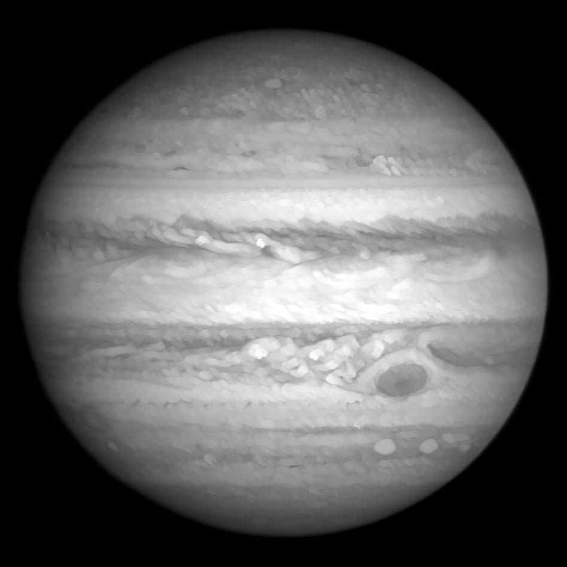
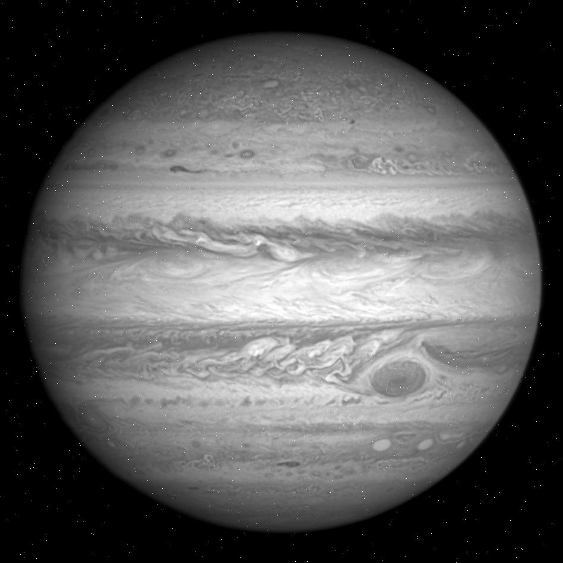
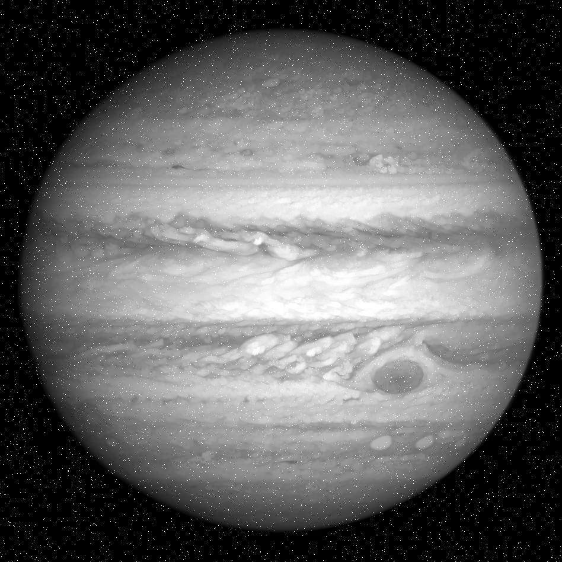
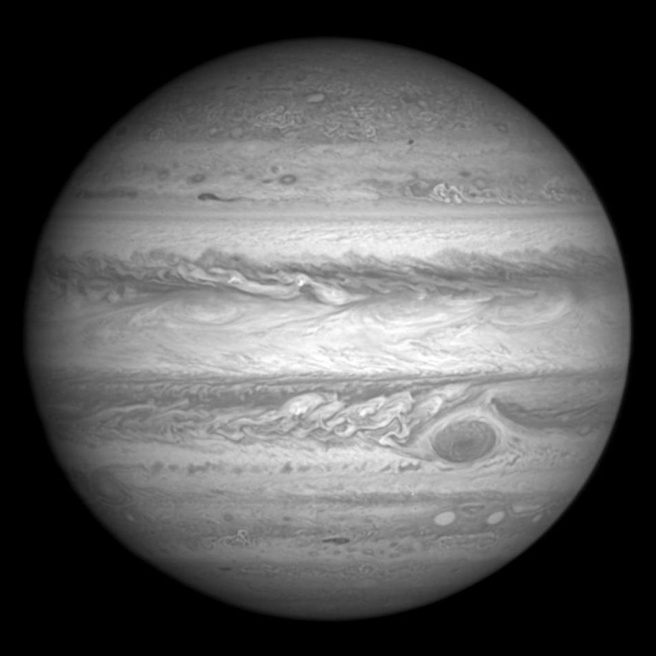
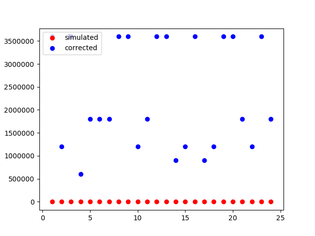
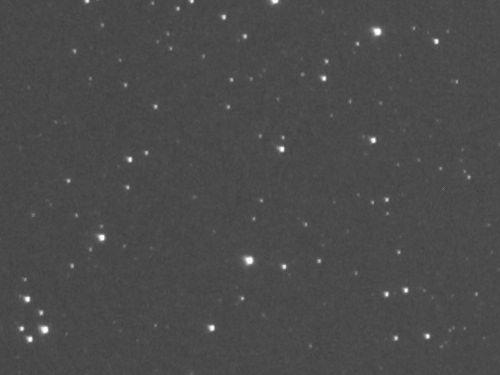
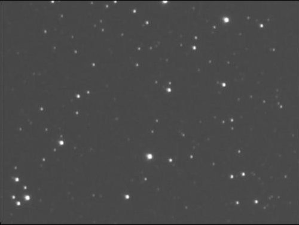
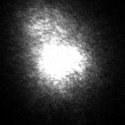
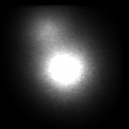
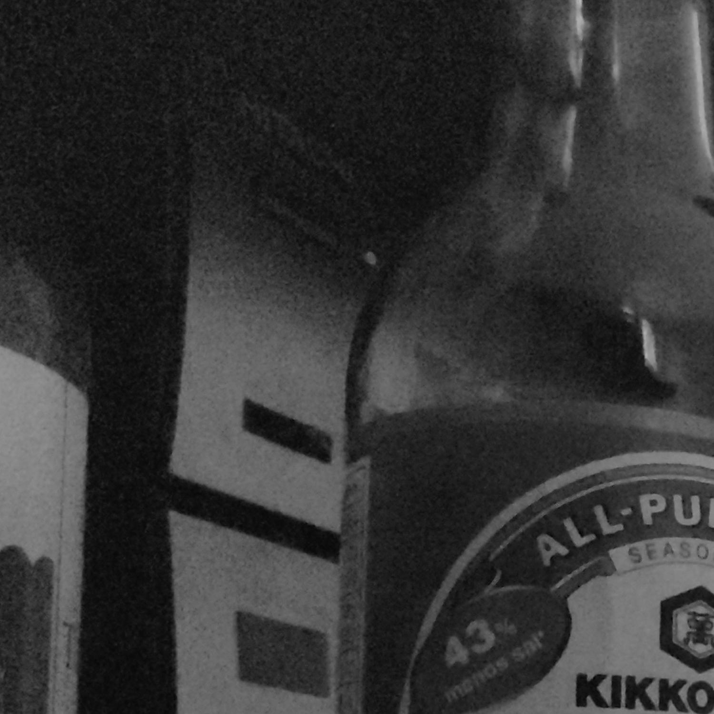

## 4. Testing

The objective of these tests is to prove that the program AIP.py improves the 
signal-to-noise ratio and sharpness of images in certain conditions.  
There are four objects images that are going to be tested: Jupiter, the night sky, 
a binary-star system and a bottle of soy sauce.

**How to run the tests**  

Of the four, the first one (Jupiter) is the only one that needs a program ([test.py](jupiter/test.py)) to be run, instructions
on how to run it are inside [jupiter](jupiter) directory. The rest of the tests can be performed by executing the program
[AIP.py](../AIP.py) while in the test directory.

### [Jupiter](jupiter/)

This test consists in simulating multiple short-exposure, noisy images, from a single picture of
jupiter. All the code fragments shown are part of [test.py](jupiter/test.py).  

  

We start with the picture above, we generate 10 pictures that simulate a series of short-exposure pictures by shifting slightly 
the image. The shifting is done by placing the image in an array of zeroes slightly bigger than the image, starting with 
a random x and y shift.
  ```python
def shift(image, max_shift):
    h, w = image.shape
    shifted_image = np.zeros(( h + max_shift, w + max_shift))
    x_shift = rd.randint(1, max_shift)
    y_shift = rd.randint(1, max_shift)
    shifted_image[y_shift: h + y_shift, x_shift: w + x_shift] = image
    return shifted_image
  ````

If we now combine the 10 images without correcting their shift, we have a simulated 
long-exposure blurred image like the one below.  

  

The next step is to add noise (salt and pepper) to the simulated short exposure images, this is done by traversing the
images and making a pixel white if it falls in a given probability. The coordinates of the generated noise are stored in
a list to identify the image noise later.

  ```python
def salt_pepper(image, probability):
    h, w = image.shape
    for y in range(h):
        for x in range(w):
            if rd.randint(1, 1000) < probability:
                image[y][x] = 255
                noise_loc.append((y, x))
    return image
  ````
The resulting simulated short-exposure images with noise look similar to the one below (click on the image to open).

  

Then, the program ([AIP.py](../AIP.py)) is run with the simulated short exposure pictures. The resulting image is compared
with the long exposure simulated image by computing the signal-to-noise ratio of both.  
On the left, the long-exposure image with noise and on the right, the result image. The difference in sharpness
is clearly noticeable (click on the images to open).

    

The signal-to-noise ratio is calculated by dividing the number of pixels of the image by the number of noise pixels.  

```python
def get_noise_ratio(image_name):
    image = cv2.imread(image_name)
    gray = cv2.cvtColor(image, cv2.COLOR_BGR2GRAY)
    noise_count = 0
    h, w = gray.shape
    dx = (w - noise_w)//2
    dy = (h - noise_h)//2
    for coordinate in noise_loc:
        y, x = coordinate
        x += dx
        y += dy
        if gray[y][x] == 255:
            noise_count += 1
    if noise_count != 0:
        return (w*h)/noise_count
    else:
        return w*h
```  

The next graph shows the signal-to-noise ratio of both images for 25 iterations of the test. It clearly shows how the noise
is reduced from the simulated long exposure image to the produced result one. The fluctuation in the signal-to-noise ratio 
of the corrected image (in blue), is caused by noise that was generated in the bright parts of the image.  

   

### [Night sky](night_sky/)

This test differs from the Jupiter test in that it starts with multiple images of the night sky, these images have both a 
shift and noise. The test evaluates how well the program mitigates noise in a real night sky scenario. Given that the noise
is not generated and can't be measured precisely, the improvement is observed by visually comparing the input images and 
the resulting one. On the left, one of the input images and on the right the result image (click on the images to open).

   


### [Binary-star system](binary_star/)

This test focuses on testing the bright-spot correlation mode with binary-star system images. In this case, with 50 different
0.06 second exposure images. Shown, on the left, one of the input images and on the right the result image (click on the images to open).

   
  
### [Bottle of soy sauce](soy_sauce/)

I wanted to include this test to show that the program is useful not only for telescope CCD images, but for normal cameras too.
To show this, I took 14 pictures with my phone camera, forcing a high ISO to obtain noisy images. The lighting of the scene
was only what came through my room's window, the exposure time was 1/640 of a second, and the ISO was 6400. Then I shifted and
saved them as grayscale. On the left, one of the input images, and on the right, the result image (click on the images to open).

   

The improvement is quite noticeable, specially if we observe the logo of my amplifier, in any of the input images the letters
can be read, whereas in the result image "HITACHI" can be easily read.


